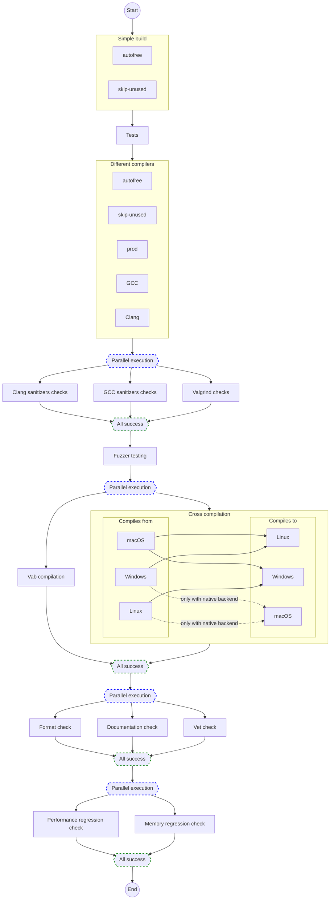

# What?

This repo contains universal minimum GitHub CI scripts and issue templates for V project.
After small modifications (specific to your project) you end up with "must-have" CI checks for
commits/PRs and nice bug/feature request templates. You will spend no time on DevOps stuff
and rush directly into the development process.

> **Note**
>
> I recommend using this basement for every V project, that will be stored on GitHub.

## Details

### `new-changes-validation` GitHub Actions workflow

The idea of this workflow is very simple - validate incoming changes,
so you make sure that changes, you are about to push to the main branch, work.
The philosophy of the workflow is also simple:

1. Code works
2. Code beautiful
3. Code fast

#### Triggers

- push (on the main branch)
- pull request

#### Flow

#### TODO
- [ ] Valgrind check
- [ ] Fuzzer testing
- [ ] Linux to macOS cross compilation
- [ ] Windows to other platforms cross compilation
- [ ] macOS to other platforms cross compilation
- [ ] Performance regression check
- [ ] Memory regression check

### Issue templates

#### `Bug` issue template

#### `Feature request` issue template

# How?

## How to use it in my project?

Just copy-paste the `.github` folder to your V project.

# Why?

## Why does one need to use this basement?

It will help to improve the quality of your code and development process for any V project.
To decide if you need to use this basement, ask yourself this question
"Would my project benefit from automatic compilation, no memory leaks, and clean code checks?"

## Why GitHub Action jobs in `new-changes-validation` are not parallel?

I decided to make a checking process sequential because of 2 reasons:

1. Make a developer focus on the right thing to fix.
It will be at least strange to fix code format and write documentation
when your code doesn't compile. Steps that should run in parallel - run in parallel.
2. Don't load runners with unneeded work.
Don't sanitize your code if it doesn't compile, so your runner can do something more valuable
(maybe checking another project). This is not that clear when you use free GitHub runners,
but it's very clear when you have limited self-hosted runners.

# Thanks

- V community - for cool programming language and CI scripts
- @ulises-jeremias for issue templates
