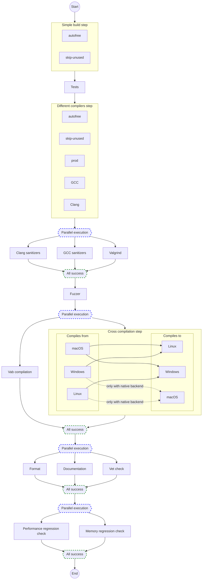

# What?

```mermaid
graph TD
	autofree_node[autofree]
	skip_unused_node[skip-unused]

	subgraph Simple_build_step[Simple build step]
		autofree_node
		skip_unused_node
	end

	autofree_node_1[autofree]
	skip_unused_node_1[skip-unused]
	prod_node[prod]
	gcc_node[GCC]
	clang_node[Clang]

	subgraph Different_compilers_step[Different compilers step]
		autofree_node_1
		skip_unused_node_1
		prod_node
		gcc_node
		clang_node
	end

	subgraph Cross_compilation_step[Cross compilation step]
    subgraph Compile_from_system[Compiles from]
      direction LR
		  linux_base[Linux]
		  windows_base[Windows]
      macos_base[macOS]
    end

    subgraph Compile_to_system[Compiles to]
      direction LR
      linux_out[Linux]
		  windows_out[Windows]
      macos_out[macOS]
    end
    
    linux_base --> windows_out
    linux_base -.-> |only with native backend|macos_out
    
    windows_base --> linux_out
    windows_base -.-> |only with native backend|macos_out
    
    macos_base --> windows_out
    macos_base --> linux_out
	end

	style parallel_exec1 stroke:blue,stroke-width:2px,stroke-dasharray: 5 5
  style parallel_exec2 stroke:blue,stroke-width:2px,stroke-dasharray: 5 5
  style parallel_exec3 stroke:blue,stroke-width:2px,stroke-dasharray: 5 5
  style parallel_exec4 stroke:blue,stroke-width:2px,stroke-dasharray: 5 5
  
	style all_success1 stroke:green,stroke-width:2px,stroke-dasharray: 5 5
	style all_success2 stroke:green,stroke-width:2px,stroke-dasharray: 5 5
	style all_success3 stroke:green,stroke-width:2px,stroke-dasharray: 5 5
	style all_success4 stroke:green,stroke-width:2px,stroke-dasharray: 5 5

	start_node((Start)) 
  --> Simple_build_step
  --> tests_node[Tests]
	--> Different_compilers_step
	--> parallel_exec1{{Parallel execution}} --> clang_sanitizers_node[Clang sanitizers] & gcc_sanitizers_node[GCC sanitizers] & valgrind_node[Valgrind] --> all_success1{{All success}}
	--> fuzzer_node[Fuzzer]
	--> parallel_exec2{{Parallel execution}} --> Cross_compilation_step & Vab_compilation_node[Vab compilation] --> all_success2{{All success}}
	--> parallel_exec3{{Parallel execution}} --> format_node[Format] & documentation_node[Documentation] & vet_node[Vet check] --> all_success3{{All success}}
	--> parallel_exec4{{Parallel execution}} --> performance_regression_node[Performance regression check] & memory_regression_node[Memory regression check] --> all_success4{{All success}}
	--> end_node((End))
```

# How?

# Why?
